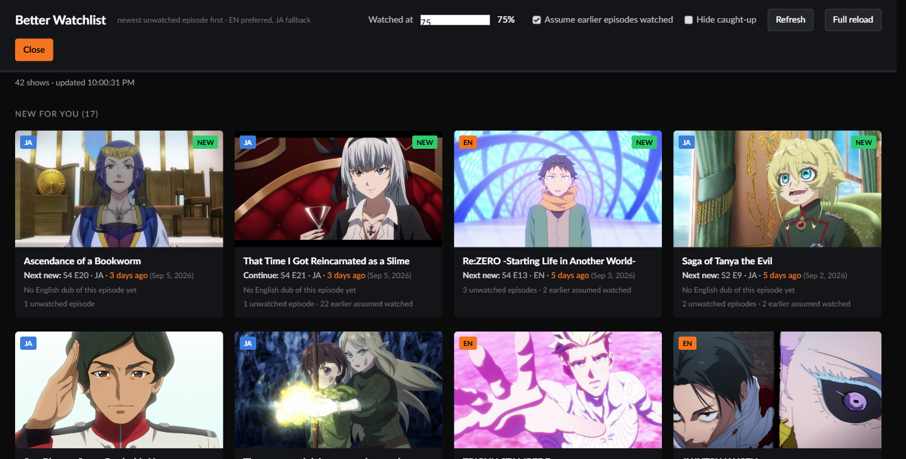
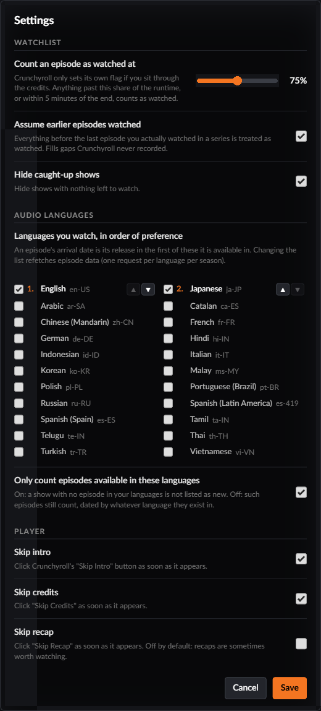

# CR Watchlist Plus

A small Chrome extension that gives your Crunchyroll watchlist the one sort order it should have shipped with:

> **The show with the newest episode you haven't watched yet comes first.**

You choose the audio languages you watch, in order of preference (English then Japanese by default). An episode's arrival date is its release in the first of those it exists in, so a dub arriving months after you watched the sub does not drag a show back to the top, and episodes you already finished in any language stay finished. Shows with nothing left to watch are hidden by default, or shown greyed in a "Caught up" section if you prefer.

It also auto-skips intros and credits in the player (and recaps, if you turn that on) by clicking Crunchyroll's own skip buttons the moment they appear.

Everything runs inside your browser, in your existing Crunchyroll login. No server, no account details stored, no analytics. The only network traffic is to crunchyroll.com, using the same internal endpoints the site's own watchlist page calls.

> Not on the Chrome Web Store. Install it unpacked from this repository (below). Not affiliated with or endorsed by Crunchyroll; it uses undocumented endpoints and may stop working when they change.

---

## Why

Crunchyroll's "Recent Activity" sort bumps a show whenever *anything* about it changes. A German dub landing for a show you finished three years ago puts it above the series that aired a new episode yesterday. The other sorts (date added, alphabetical, date watched) do not help either. There is no server-side option for "newest episode", let alone "newest episode I haven't seen, in a language I watch".

## What it does

- Reads your watchlist, every season (and movie, and OVA collection) of every show, and every episode in each audio language you have chosen.
- Reads your playheads for **every** language version of each episode, so an episode watched in Japanese counts as watched when the English dub arrives.
- Treats an episode as watched once you are past an adjustable share of its runtime (default 75%), because Crunchyroll only sets its own completed flag if you sit through the ending theme. Skipping the credits otherwise leaves finished episodes at 80 to 90% and they resurface as unwatched.
- Optionally assumes everything *before* the last episode you watched in a series is watched too (on by default, see below). This fills gaps such as pre-merger Funimation history that never reached Crunchyroll.
- Ranks shows by the newest unwatched episode's arrival date and renders its own grid over the watchlist page. Each card links to that exact episode in the language shown.
- Remembers that you had the overlay open. Click an episode, watch it, come back to the watchlist by any route, and the overlay is there again with your progress refreshed.
- In the player, watches for Crunchyroll's "Skip Intro", "Skip Recap" and "Skip Credits" buttons and clicks the ones you have enabled as soon as they become visible. No seeking of its own, so it can only skip what Crunchyroll has marked.
- Caches episode lists for 12 hours, so the first open takes 10 to 30 seconds and later opens a couple of seconds.

## Install (unpacked, Chrome or any Chromium browser)

1. Download this repository: **Code → Download ZIP**, then unzip it somewhere permanent. Or `git clone` it.
2. Open `chrome://extensions` in the address bar.
3. Turn on **Developer mode** (toggle, top right).
4. Click **Load unpacked** and choose the unzipped folder (the one containing `manifest.json`).
5. Go to <https://www.crunchyroll.com/watchlist>, logged in. An orange **CR Watchlist Plus** button appears bottom-right. Click it.

The toolbar icon (orange play button; pin it via the puzzle-piece menu) also opens the overlay, focusing an existing watchlist tab if you have one.

### Updating

Pull or re-download the folder, then on `chrome://extensions` click the reload arrow on the extension card. Cached data is versioned; if a release changes the cache format the first open refetches and everything else carries over. Your settings live in a cookie and are unaffected.

### Uninstall

Remove it from `chrome://extensions`. Nothing is left behind on Crunchyroll's side; the extension never writes to your account. Two cookies on crunchyroll.com remain until they expire or you clear site data (see Privacy).

## The overlay

| Control | What it does |
|---|---|
| **Settings** | Opens the settings dialog (below). Changes apply on **Save** and re-rank instantly from cached data. |
| **Refresh** | Re-reads your watchlist and playheads, reusing cached episode lists. Use after watching something. |
| **Full reload** | Drops the cache and refetches everything. Use if a new episode has not shown up within 12 hours. |
| **Normal Watchlist** | Closes the overlay and returns you to Crunchyroll's own page. Also stops the overlay reopening automatically until you click the button again. |

### Settings

| Setting | Default | What it does |
|---|---|---|
| **Count an episode as watched at** | 75% | Threshold past which an episode counts as watched (50 to 100%). An episode also counts if within 5 minutes of the end, or if Crunchyroll's own completed flag is set. |
| **Assume earlier episodes watched** | on | The high-water rule. Everything before the last episode you actually watched in a series is treated as watched. Cards show how many episodes were inferred. |
| **Hide caught-up shows** | on | Hides shows with nothing left to watch. When on, a footnote says how many are hidden. |
| **Languages you watch, in order of preference** | English, Japanese | Tick the audio languages you watch and order them with the arrows. An episode's arrival date is its release in the first ticked language it exists in, and the card links to that version. Changing the list refetches episode data: one request per language per season, so five languages is roughly two and a half times the first-load time of two. At least one language must stay ticked. |
| **Only count episodes available in these languages** | on | On: an episode that exists in none of your languages is ignored, so a show whose latest episode is Japanese-only is not "new" for an English-only viewer. Off: such episodes still count, dated and linked by whatever language they exist in. |
| **Skip intro** | on | Player: click "Skip Intro" as soon as it appears. |
| **Skip credits** | on | Player: click "Skip Credits" as soon as it appears. |
| **Skip recap** | off | Player: click "Skip Recap" as soon as it appears. Off by default because recaps are sometimes worth watching. |

Settings are stored in a cookie for `.crunchyroll.com`, not in the extension, so they survive reinstalling the extension and are visible to the video player, which lives in an iframe on `static.crunchyroll.com`. Chrome caps cookie lifetime at 400 days; the cookie is rewritten every time the overlay opens, so in practice it never expires while you use it. Defaults are written on first open. Player settings take effect on the next skip button to appear; no reload needed.

### Reading a card

- **Flag badge** (top left of the thumbnail): the audio language the card's episode is in. Flags for English (Union Jack), Japanese, German, French, Italian and Russian; a two-letter text code for anything else. Hover for the full name.
- **NEW** badge: that episode arrived in the last 7 days.
- **Next new:** the newest episode you have not started. **Continue:** you have started it. **Latest:** shown on caught-up shows for the most recent episode.
- **S2 E9**, **Operation Desert Pasta**, **OVA Season 1 E3**: Crunchyroll's instalment title, not its internal season counter (which numbers movies and OVAs as seasons), then the episode number.
- **No English audio for this episode yet** (or whichever language is first in your list): the newest unwatched episode is not yet available in your first-choice language, so it is dated by the next one that has it.
- **N unwatched episodes · M earlier assumed watched**: the count still to watch, and how many the high-water rule filled in.
- **Could not load** (orange): part or all of that show failed to fetch. Such shows are listed in their own section, never as caught up, so a network hiccup cannot hide a new episode. Try **Refresh**.

## How auto-skip works

Crunchyroll's player runs in an iframe on `static.crunchyroll.com`, so the content script runs in every frame. Inside the player it watches the DOM for elements whose `data-testid` or label contains "skip", classifies each as intro, recap or credits from the **visible button text** (Crunchyroll reuses the same test id and aria-label across its skip buttons, so those are only a fallback), checks the matching setting in the shared cookie, and clicks the enclosing button once it is actually visible. There is a short cooldown per kind so a button that lingers is not clicked twice. Nothing is seeked or skipped that Crunchyroll has not itself offered a button for.

Every decision is logged in the player frame's console as `[CR Watchlist Plus] auto-skipped …` or `… left alone (… off)`, so if a button is ever skipped or ignored unexpectedly, DevTools → Console → select the `static.crunchyroll.com` frame shows exactly what label it read.

## How the ranking works

For each show:

1. Instalments (seasons, movies, OVA collections) are put in **chronological order by the original air date of their first episode**, with Crunchyroll's episode sequence kept inside each. Crunchyroll's own season order is editorial and often lists OVAs and movies after the main run.
2. For each episode, collect the versions in each of your chosen languages, with their ids and release dates. *Arrival date* is the release in the first of your languages the episode exists in. With "Only count episodes available in these languages" off, an episode in none of them is dated by whatever language it does exist in; with it on, that episode is ignored.
3. An episode is **watched** if either version is fully watched, or either version's playhead is past the threshold or within five minutes of the end (for episodes longer than five minutes).
4. With the high-water rule on, every episode that precedes the last watched one (in the order from step 1) is also treated as watched.
5. The show's sort key is the latest arrival date among its unwatched, already-released episodes. Shows with none are ranked by their latest arrival overall and shown under "Caught up" if that section is enabled.

The episode cache is keyed by the language list, so changing languages refetches once and then caches as normal.

## Known issues and edge cases

- **OVA collections spanning years.** An OVA "season" is placed by the air date of its *first* episode, but Crunchyroll often groups OVAs released over several years into one collection. A late OVA can therefore sit before a TV season that aired after it, and the high-water rule will infer it watched once you finish that season. Slime's "OVA Season 1" (2019 to 2020) is the live example. Per-episode ordering would fix this but breaks recap and special episodes that air out of sequence; the trade-off is left as is. Turn the high-water rule off if it bites.
- **The high-water rule is an inference.** It cannot tell "watched elsewhere or skipped on purpose" from "abandoned halfway". A movie you stopped at 51% before finishing the next season will be treated as watched. Cards show the inferred count so you can see when it has acted.
- **Episodes with no duration** in Crunchyroll's data only count as watched via Crunchyroll's own completed flag, never via the percentage rule.
- **Messy instalment names.** Labels strip the series name and "(English Dub)" and recognise "Season 2", "Season2" and Roman numerals, but instalments whose title is only a year or a subtitle show that fragment, for example "3199 E19".
- **Legacy dub seasons.** Very old catalogue entries where the dub is a separate season with no version links are treated as separate instalments, so watched-in-Japanese suppression does not apply to them.
- **Auto-skip depends on Crunchyroll's markup and English labels.** Detection finds buttons by a `data-testid` or aria-label containing "skip", then classifies by the visible text ("Skip Intro", "Skip Recap", "Skip Credits", plus "opening", "outro", "ending" variants). Other interface languages are not matched; a player UI change that drops those attributes will stop it silently. There is no "Skip Preview" or auto-play-next.
- **Flags are drawn, not emoji.** Chrome on Windows cannot render flag emoji, so the six flags are CSS (two inline SVGs, four gradients) and other languages fall back to a two-letter code.
- **Many languages means many requests.** Each chosen language costs one request per season on a cold cache. Two languages on a 40-show list is about 350 requests; six languages roughly triples the fetch phase. Crunchyroll rate-limits gently and the extension backs off and retries, but a very long list with many languages will take a minute or two on first load.
- **Unofficial API.** Crunchyroll can change endpoints or the web client id without notice. If the overlay shows "Token exchange failed", compare the `WEB_CLIENT_BASIC` constant in `content.js` with the Authorization header the site sends to `/auth/v1/token` (DevTools → Network). The id is Crunchyroll's public web-app client id with an empty secret; it is not a credential.
- **Chrome only.** Manifest V3 with a service worker. Firefox would need a `browser_specific_settings` block and a background script.

## Files

| File | Purpose |
|---|---|
| `manifest.json` | Extension manifest (MV3). Content script on all crunchyroll.com subdomains and frames, storage permissions, toolbar action, icons. |
| `content.js` | Everything: token exchange, API calls, caching, ranking, UI, and the player auto-skip (runs in all frames; only the auto-skip part runs inside iframes). |
| `content.css` | Overlay styling, including the SVG flag badges. |
| `background.js` | Toolbar click → focus an open watchlist tab and show the overlay, or open one. |
| `icons/` | Toolbar and extension icons. |
| `docs/screenshot.png`, `docs/settings.png` | The images above. |

## Privacy

The extension reads your watchlist, episode metadata and playheads from crunchyroll.com and stores derived data in the extension's local storage on your machine. It sets two cookies for `.crunchyroll.com`: `cr_watchlist_plus_prefs` (your settings) and `cr_watchlist_plus_active` (whether to reopen the overlay when you return to the watchlist). It generates a random device id per install for Crunchyroll's token exchange, stored locally; this is not linked to you and exists only so every install does not present the same device. It sends nothing anywhere else and never modifies your Crunchyroll account.

## How it was built

This extension was written with an AI coding assistant (Claude, by Anthropic) working in Claude Code, directed and tested by the repository owner. The AI reverse-engineered the endpoints from the live site's network traffic, wrote the code, and verified behaviour against a real watchlist; design decisions such as the 75% watched threshold, the high-water rule and the instalment ordering came out of that back-and-forth. A second AI model then reviewed the code, documentation and git history before release. Treat the code accordingly: read it before you trust it.

## Licence

MIT. Not affiliated with or endorsed by Crunchyroll.
